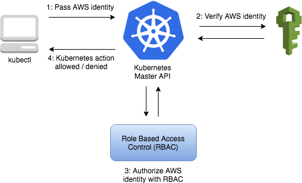

# Security: Know How to Configure Authentication and Authorization

Back to [Certified Kubernetes Administrator (CKA) Tutorial](https://github.com/larkintuckerllc/k8s-cka-tutorial)

[](https://youtu.be/1tQKe7X1BV4)

## Script

Now that we have explored authentication by manually creating Certificates for the cluster we created using *kubeadm*, we explore how authentication works for our EKS cluster.

If you recall, we used the following command as part of our EKS install:

```plaintext
aws eks --region us-east-1 update-kubeconfig --name k8s-cka-tutorial
```

Now that we are more familiar with the *kubectl* config file, let us see how it is configured. Observe that the *cluster* and *context* are configured as we saw earlier.

```plaintext
cat .kube/config
```

But here the *user* is configured using an external command:

> This feature is intended for client side integrations with authentication protocols not natively supported by k8s.io/client-go (LDAP, Kerberos, OAuth2, SAML, etc.). The plugin implements the protocol specific logic, then returns opaque credentials to use. Almost all credential plugin use cases require a server side component with support for the webhook token authenticator to interpret the credential format produced by the client plugin.

*-Kubernetes-[Authenticating](https://kubernetes.io/docs/reference/access-authn-authz/authentication/)*

The AWS documentation confirms the general flow:



*-AWS-[Managing cluster authentication](https://docs.aws.amazon.com/eks/latest/userguide/managing-auth.html)*

Running this command manually, we indeed see it returns a token (wrapped in some JSON). Thinking about our authenticating mechanisms, this is an example were we are using a JWT token:

```plaintext
aws eks get-token --region us-east-1 --cluster-name k8s-cka-tutorial
```

Notice that to switch users, we then only need to change the credentials used by AWS CLI using *aws configure*. We can use the following command to verify the current credentials.

```plaintext
aws sts get-caller-identity
```

Now we need to understand how AWS IAM credentials get mapped to K8S user and group values. For the user we installed the EKS cluster with:

> When you create an Amazon EKS cluster, the IAM entity user or role, such as a federated user that creates the cluster, is automatically granted system:masters permissions in the cluster's RBAC configuration.

*-AWS-[Managing users or IAM roles for your cluster](https://docs.aws.amazon.com/eks/latest/userguide/add-user-role.html)*

**note:** If you recall, *system:masters* is associated with the *cluster-admin*  ClusterRole which gives one full access to K8s.

### Granting Access to Another Cluster Administrator

Say we had a second IAM user, e.g., *fred* and we want to give that user full access. This amounts to editing a K8s configuration and add a section:

```plaintext
kubectl edit configmap/aws-auth -n kube-system
```

We need to add a section:

```plaintext
  mapUsers: |
    - userarn: arn:aws:iam::143287522423:user/fred
      username: fred
      groups:
        - system:masters
```

**note:** This is an example of a more general K8s object, *ConfigMap* that we will explore more in depth later.

With this in place, we can login to AWS CLI using *fred* and validate that we still can use *kubectl*.

```plaintext
aws configure

kubectl get all --all-namespaces
```

### Authorization Modes

Authorization can flow through one or more modes:

* Node: Special purpose permissions for Nodes

* ABAC: Attribute-based access control (fallen out of favor, complicated)

* RBAC: Role-based access control

* Webhook: Custom

We will focus on RBAC.

### Authorization Rules

Authorization operates on API requests and as we saw before there were resource (aka. K8s objects) and non-resourced API calls.

Recall *cluster-admin* rules:

```plaintext
kubectl get clusterrole cluster-admin -o yaml
```

Authorizing non-resource API calls are simple as supplying the request path, e.g., */healthz*, and HTTP verb, e.g., *post*, *get*, *put*, and *delete*. These are the four CRUD operations.

Authorizing resource API calls are more complicated and involve supplying:

* API Group

* Resource (e.g., *pods*)

* Verb, (e.g., *get*)

* (optional) Name

**note:** Namespaces are not supplied in rules; but are used elsewhere (later).

We can get a listing of this information using:

```plaintext
kubectl api-resources -o wide
```

We can also validate our or other's authorization for an API request:

```plaintext
kubectl auth can-i create deployments

kubectl auth can-i create deployments --namespace test

kubectl auth can-i create deployments --as fred.administrator

kubectl auth can-i create deployments --as fred.administrator --as-group system:masters
```

### RBAC ClusterRole

> An RBAC Role or ClusterRole contains rules that represent a set of permissions. Permissions are purely additive (there are no “deny” rules).

*-Kubernetes-[Using RBAC Authorization](https://kubernetes.io/docs/reference/access-authn-authz/rbac/)*

Let us start by exploring default on ClusterRoles (we will get to Roles later):

```plaintext
kubectl get clusterroles
```

Notice that there are four "user-facing", e.g., not system, ClusterRoles:

* cluster-admin: cluster-wide super-user or root

* admin: intended to delegate admin access to a namespace; managing authorization, write, and read

* edit: write and read

* view: read

```plaintext
kubectl describe clusterrole view
```

### RBAC RoleBinding and ClusterRoleBinding

> A role binding grants the permissions defined in a role to a user or set of users. It holds a list of subjects (users, groups, or service accounts), and a reference to the role being granted. A RoleBinding grants permissions within a specific namespace whereas a ClusterRoleBinding grants that access cluster-wide.

*-Kubernetes-[Using RBAC Authorization](https://kubernetes.io/docs/reference/access-authn-authz/rbac/)*

We look at all the ClusterRoleBindings (most are system related):

```plaintext
kubectl get clusterrolebindings
```

We then look at one of them in detail:

```plaintext
kubectl describe clusterrolebinding cluster-admin
```

We look at all the RoleBindings (all are system related):

```plaintext
kubectl get rolebindings --all-namespaces
```
