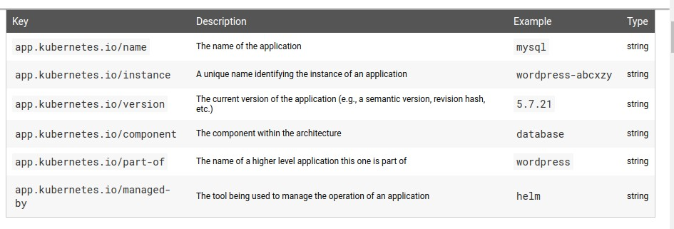
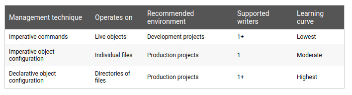

# Core Concepts: Understand the Kubernetes API Primitives

Back to [Certified Kubernetes Administrator (CKA) Tutorial](https://github.com/larkintuckerllc/k8s-cka-tutorial)

[](XXXXX)

## Script

In this video we are going to focus on K8s object management. Recall that we can get a list of the kinds of objects we can work with:

```plaintext
kubectl api-resources
```

As we will see through example shortly, we will use *Name* or *Shortname* in the CLI and *Kind* in configuration files.

### Metadata

We learned about three K8s metadata values previously:

* Namespace: For Namespaced objects, refers to a valid Namespace

* Name: Unique value (either cluster-wide or in Namespace)

* UIDs:: Unique autogenerated value

Friendly listing:

```plaintext
kubectl describe cm example
```

Detailed listing:

```plaintext
kubectl get cm example -o yaml
```

#### Labels

> Labels are key/value pairs that are attached to objects, such as pods. Labels are intended to be used to specify identifying attributes of objects that are meaningful and relevant to users, but do not directly imply semantics to the core system. Labels can be used to organize and to select subsets of objects. Labels can be attached to objects at creation time and subsequently added and modified at any time.
>Labels are key/value pairs. Valid label keys have two segments: an optional prefix and name, separated by a slash (/). The name segment is required and must be 63 characters or less, beginning and ending with an alphanumeric character ([a-z0-9A-Z]) with dashes (-), underscores (_), dots (.), and alphanumerics between. The prefix is optional. If specified, the prefix must be a DNS subdomain: a series of DNS labels separated by dots (.), not longer than 253 characters in total, followed by a slash (/).
>If the prefix is omitted, the label Key is presumed to be private to the user.

*-Kubernetes-[Labels and Selectors](https://kubernetes.io/docs/concepts/overview/working-with-objects/labels/)*

```plaintext
kubectl get node ip-192-168-190-200.ec2.internal -o yaml
```

> The metadata is organized around the concept of an application. Kubernetes is not a platform as a service (PaaS) and doesn’t have or enforce a formal notion of an application. Instead, applications are informal and described with metadata. The definition of what an application contains is loose.



*-Kubernetes-[Recommended Labels](https://kubernetes.io/docs/concepts/overview/working-with-objects/common-labels/)*

#### Annotations

> You can use Kubernetes annotations to attach arbitrary non-identifying metadata to objects. Clients such as tools and libraries can retrieve this metadata.

*-Kubernetes-[Annotations](https://kubernetes.io/docs/concepts/overview/working-with-objects/annotations/)

```plaintext
kubectl get node ip-192-168-190-200.ec2.internal -o yaml
```

### Data

> A Kubernetes object is a “record of intent”--once you create the object, the Kubernetes system will constantly work to ensure that object exists. By creating an object, you’re effectively telling the Kubernetes system what you want your cluster’s workload to look like; this is your cluster’s desired state.

*-Kubernetes-[Understanding Kubernetes Objects](https://kubernetes.io/docs/concepts/overview/working-with-objects/kubernetes-objects/)*

> Almost every Kubernetes object includes two nested object fields that govern the object’s configuration: the object spec and the object status. For objects that have a spec, you have to set this when you create the object, providing a description of the characteristics you want the resource to have: its desired state.
> The status describes the current state of the object, supplied and updated by the Kubernetes system and its components. The Kubernetes control plane continually and actively manages every object’s actual state to match the desired state you supplied.

*-Kubernetes-[Understanding Kubernetes Objects](https://kubernetes.io/docs/concepts/overview/working-with-objects/kubernetes-objects/)*

Example:

```plaintext
kubectl get node ip-192-168-190-200.ec2.internal -o yaml
```

Counter Example:

```plaintext
kubectl get cm example -o yaml
```

### Management Techniques

This topic, while seemingly simple, is surprisingly deep:

> Kubernetes objects should be managed using only one method at a time. Switching from one method to another is possible, but is a manual process.
> Note: It is OK to use imperative deletion with declarative management.

*-Kubernetes-[Declarative Management of Kubernetes Objects Using Configuration Files](https://kubernetes.io/docs/tasks/manage-kubernetes-objects/declarative-config/#how-apply-calculates-differences-and-merges-changes)*



*-Kubernetes-[Kubernetes Object Management](https://kubernetes.io/docs/concepts/overview/working-with-objects/object-management/)*

#### Imperative Commands

K8s state is authoratitive:

> When using imperative commands, a user operates directly on live objects in a cluster. The user provides operations to the kubectl command as arguments or flags.
> This is the simplest way to get started or to run a one-off task in a cluster. Because this technique operates directly on live objects, it provides no history of previous configurations.

*-Kubernetes-[Kubernetes Object Management](https://kubernetes.io/docs/concepts/overview/working-with-objects/object-management/)*

Create:

```plaintext
kubectl create configmap example \
  --from-literal=a=apple \
  --from-literal=b=banana
```

While conceptually simply, one observation is that one has to learn a bunch of commands and command line options.

We see results:

```plaintext
kubectl get configmap example -o yaml
```

Delete:

```plaintext
kubectl delete configmap example
```

#### Imperative Object Configuration

File is authoritative:

> In imperative object configuration, the kubectl command specifies the operation (create, replace, etc.), optional flags and at least one file name. The file specified must contain a full definition of the object in YAML or JSON format.

*-Kubernetes-[Kubernetes Object Management](https://kubernetes.io/docs/concepts/overview/working-with-objects/object-management/)*

Create:

```plaintext
kubectl create -f example.yaml
```

We see results:

```plaintext
kubectl get configmap example -o yaml
```

We see that some values are defaulted, e.g. *creationTimestamp*:

Replace:

```plaintext
kubectl replace -f example.yaml
```

Notice *creationTimestamp*.

```plaintext
kubectl get configmap example -o yaml
```

Delete:

```plaintext
kubectl delete -f example.yaml
```

How do we know how to create file?

```plaintext
kubectl create configmap example \
  --from-literal=a=apple \
  --from-literal=b=banana \
  --dry-run \
  -o yaml
```

#### Declarative Object Configuration

Back to K8s state is authoratitive:

> When using declarative object configuration, a user operates on object configuration files stored locally, however the user does not define the operations to be taken on the files. Create, update, and delete operations are automatically detected per-object by kubectl. This enables working on directories, where different operations might be needed for different objects.

*-Kubernetes-[Kubernetes Object Management](https://kubernetes.io/docs/concepts/overview/working-with-objects/object-management/)*

Create:

```plaintext
kubectl apply -f example.yaml
```

We see results:

```plaintext
kubectl get configmap example -o yaml
```

We see the difference:

```plaintext
kubectl diff -f example.yaml
```

We apply the patch:

```plaintext
kubectl apply -f example.yaml
```

We see the result:

```plaintext
kubectl get configmap example -o yaml
```

Merge patch calculation:

> 1. Calculate the fields to delete. These are the fields present in last-applied-configuration and missing from the configuration file.
> 2. Calculate the fields to add or set. These are the fields present in the configuration file whose values don’t match the live configuration.

*-Kubernetes-[Declarative Management of Kubernetes Objects Using Configuration Files](https://kubernetes.io/docs/tasks/manage-kubernetes-objects/declarative-config/#how-apply-calculates-differences-and-merges-changes)*

Let us walk through example:

```plaintext
kubectl diff -f example.yaml
```

Apply:

```plaintext
kubectl apply -f example.yaml
```

We see result:

```plaintext
kubectl get configmap example -o yaml
```

Deletion is still imperative:

```plaintext
kubectl delete -f example.yaml
```

#### Declarative Object Configuration Details

We can apply folders:

```plaintext
kubectl apply -f project
```

We see result:

```plaintext
kubectl get cm
```

Create a file (example3.yaml) and edit example2.yaml and delete a file example.yaml; We see diff:

```plaintext
kubectl diff -f project
```

What happens if we need to deal with fields set by other writers?

Walk through example of Default Field Values and:

> How to clear server-defaulted fields or fields set by other writers
Fields that do not appear in the configuration file can be cleared by setting their values to null and then applying the configuration file. For fields defaulted by the server, this triggers re-defaulting the values.

*-Kubernetes-[Declarative Management of Kubernetes Objects Using Configuration Files](https://kubernetes.io/docs/tasks/manage-kubernetes-objects/declarative-config/#how-apply-calculates-differences-and-merges-changes)*
