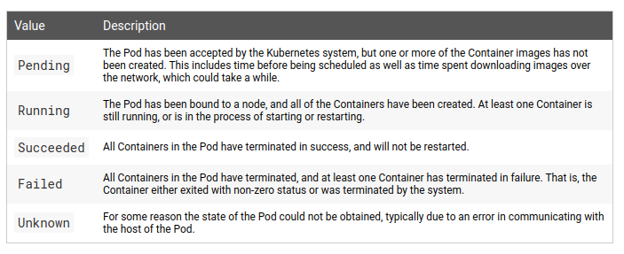

# Application Lifecycle Management: Know Various Ways to Configure Applications

Back to [Certified Kubernetes Administrator (CKA) Tutorial](https://github.com/larkintuckerllc/k8s-cka-tutorial)

[](https://youtu.be/XXXXX)

## Script

Quite frankly, I am glad to moving onto other K8s persisted objects other than ConfigMaps.

Will assume that the we all already have the basic understanding of Images, Containers, and Repositories as per [Docker Quickstart](https://docs.docker.com/get-started/).

> A Pod is the basic execution unit of a Kubernetes application--the smallest and simplest unit in the Kubernetes object model that you create or deploy. A Pod represents processes running on your cluster.
> A Pod encapsulates an application’s container (or, in some cases, multiple containers), storage resources, a unique network identity (IP address), as well as options that govern how the container(s) should run. A Pod represents a unit of deployment: a single instance of an application in Kubernetes, which might consist of either a single container or a small number of containers that are tightly coupled and that share resources.

*-Kubernetes-[Pod Overview](https://kubernetes.io/docs/concepts/workloads/pods/pod-overview/)*

As we have seen before, the *hello-pod* folder was scaffolded using *helm create hello-pod* wiped clean of the sample configuration.

Let us look at the *Pod* configuration.

**note:** This example uses an image from a public repository. The EKS setup automatically enables access to Elastic Container Registry (ECR) too.

And then create the Pod with:

```plaintext
helm install dev hello-pod
```

> Like individual application containers, Pods are considered to be relatively ephemeral (rather than durable) entities. As discussed in pod lifecycle, Pods are created, assigned a unique ID (UID), and scheduled to nodes where they remain until termination (according to restart policy) or deletion. If a Node dies, the Pods scheduled to that node are scheduled for deletion, after a timeout period. A given Pod (as defined by a UID) is not “rescheduled” to a new node; instead, it can be replaced by an identical Pod, with even the same name if desired, but with a new UID (see replication controller for more details).

*-Kubernetes-[Pods](https://kubernetes.io/docs/concepts/workloads/pods/pod/)*

> Pods are the fundamental building block of Kubernetes applications. Since Pods are intended to be disposable and replaceable, you cannot add a container to a Pod once it has been created. Instead, you usually delete and replace Pods in a controlled fashion using deployments.

*-Kubernetes-[Ephemeral Containers](https://kubernetes.io/docs/concepts/workloads/pods/ephemeral-containers/)*

Do example of editing *hello-pod.yaml* by adding a container and try to upgrade using:

```plaintext
helm upgrade dev hello-pod
```

### Pod Status (Phase)

We then inspect the Pod with particular attention to the status of the Pod:

```plaintext
kubectl get pods
```

```plaintext
kubectl describe pod hello-dev
```

```plaintext
kubectl get pod hello-dev -o yaml
```

We see that *status* is better described as *phase*:



*-Kubernetes-[Pod Lifecycle](https://kubernetes.io/docs/concepts/workloads/pods/pod-lifecycle/)*

**note**: The K8s documentation authors go to some length to warn the reader to not read more into this value.

It is important to note that a running Pod can have containers in a variety of states.

### Pod Conditions

More detailed information about the status of the Pod can be seen with Pod Conditions:

* *PodScheduled*: the Pod has been scheduled to a node;

* *Initialized*: all init containers have started successfully;

* *ContainersReady*: all containers in the Pod are ready.

* *Ready*: the Pod is able to serve requests and should be added to the load balancing pools of all matching Services;

**note:** We will cover init containers later.

**note:** We will also cover how a Pod can have all its containers ready but still not be in the Ready condition.

```plaintext
kubectl describe pod hello-dev
```

```plaintext
kubectl get pod hello-dev -o yaml
```

### Container States

This leads us to examine the Pod's Containers in more detail:

> Once Pod is assigned to a node by scheduler, kubelet starts creating containers using container runtime.There are three possible states of containers: Waiting, Running and Terminated.

* *Waiting*: Default state of container. If container is not in either Running or Terminated state, it is in Waiting state. A container in Waiting state still runs its required operations, like pulling images, applying Secrets, etc.

* *Running*: Indicates that the container is executing without issues.

* *Terminated*: Indicates that the container completed its execution and has stopped running. A container enters into this when it has successfully completed execution or when it has failed for some reason.

*-Kubernetes-[Pod Lifecycle](https://kubernetes.io/docs/concepts/workloads/pods/pod-lifecycle/)*

```plaintext
kubectl describe pod hello-dev
```

**note:** For now we will consider a container Running when the entry point is executed. While accurate in this particular example, it requires further discussion (later).

**note:** For now we will consider a container Ready when it is in the Running state. While accurate in this particular example, it requires further discussion (later).

> A PodSpec has a restartPolicy field with possible values Always, OnFailure, and Never. The default value is Always. restartPolicy applies to all Containers in the Pod. restartPolicy only refers to restarts of the Containers by the kubelet on the same node. Exited Containers that are restarted by the kubelet are restarted with an exponential back-off delay (10s, 20s, 40s …) capped at five minutes, and is reset after ten minutes of successful execution. As discussed in the Pods document, once bound to a node, a Pod will never be rebound to another node.

*-Kubernetes-[Pod Lifecycle](https://kubernetes.io/docs/concepts/workloads/pods/pod-lifecycle/)*

```plaintext
kubectl get pod hello-dev -o yaml
```

### Execute Commands on Containers

We can execute commands on the Pod's running container.

```plaintext
kubectl exec hello-dev -- ls
```

We can even open an interactive terminal:

```plaintext
kubectl exec hello-dev -it -- bash

ls
```

**note:** Can supply the additional *--container* option if multiple containers.

### Container Environment

> The Kubernetes Container environment provides several important resources to Containers:

* A filesystem, which is a combination of an image and one or more volumes.

* Information about the Container itself.

* Information about other objects in the cluster.

*-Kubernetes-[Container Environment](https://kubernetes.io/docs/concepts/containers/container-environment/)*

Observe hostname is the Pod's name:

```plaintext
hostname
```

Observe the Kubernetes service IP address and port:

```plaintext
printenv
```

Means that container has a way to access the K8s API.

The K8s API is also accessible via a DNS name (as long as DNS Addon is in place):

```plaintext
apt-get update
apt-get install dnsutils -y
nslookup kubernetes
```

In addition to the image, the Container provides a writable layer. This is why we could install a package:

> When you create a new container, you add a new writable layer on top of the underlying layers. This layer is often called the “container layer”. All changes made to the running container, such as writing new files, modifying existing files, and deleting files, are written to this thin writable container layer.

—Docker—[About Storage Drivers](https://docs.docker.com/storage/storagedriver/)

**note:** It is important to note that this writable layer does not persist across container restarts; we will talk about Volumes later.
