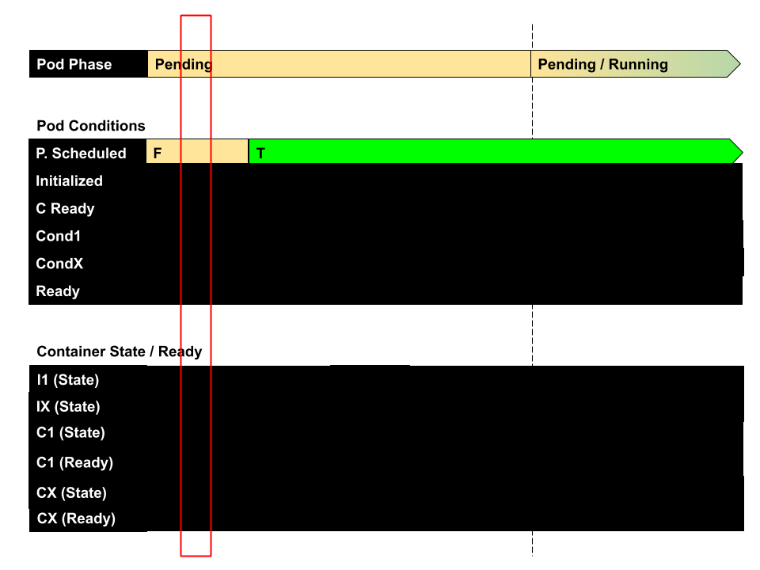
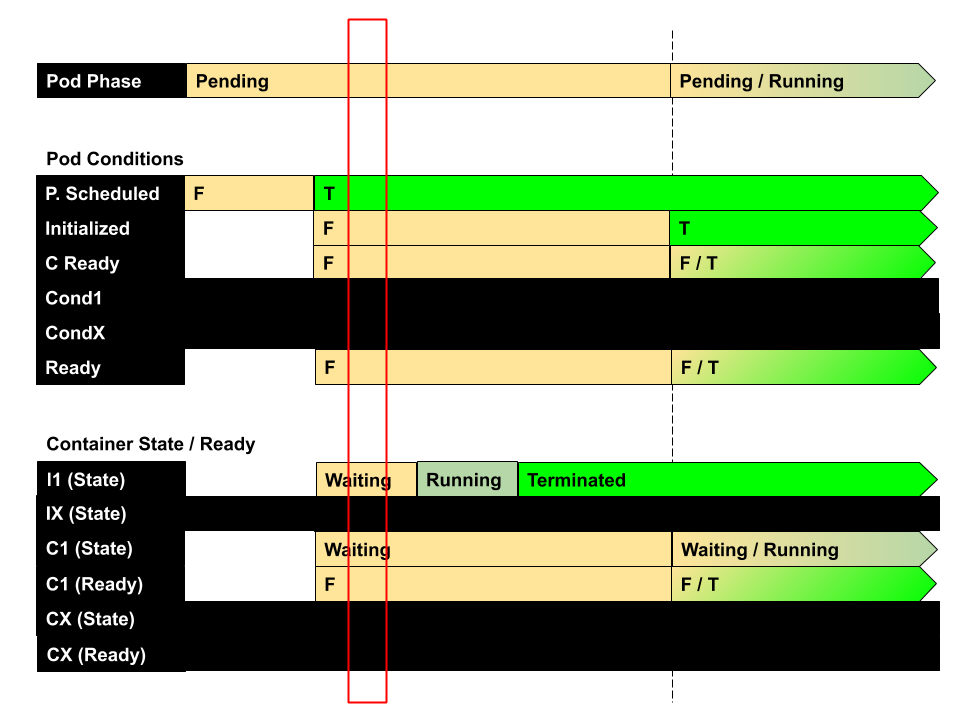
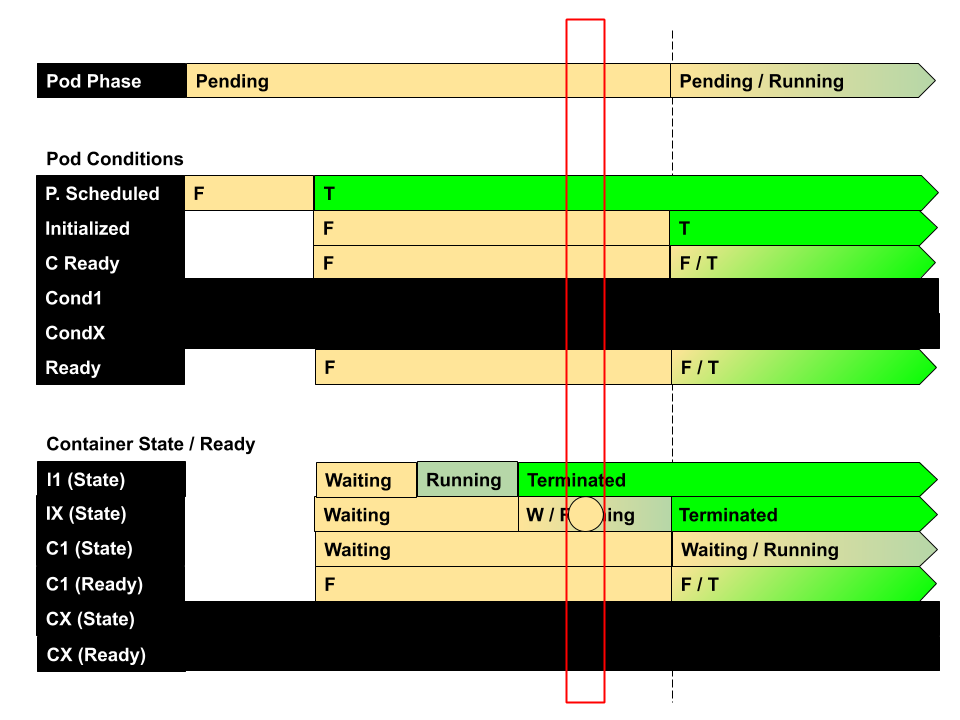
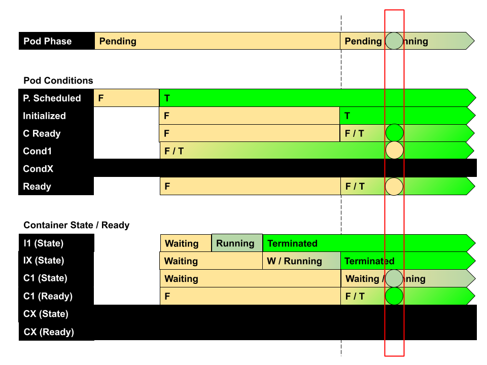
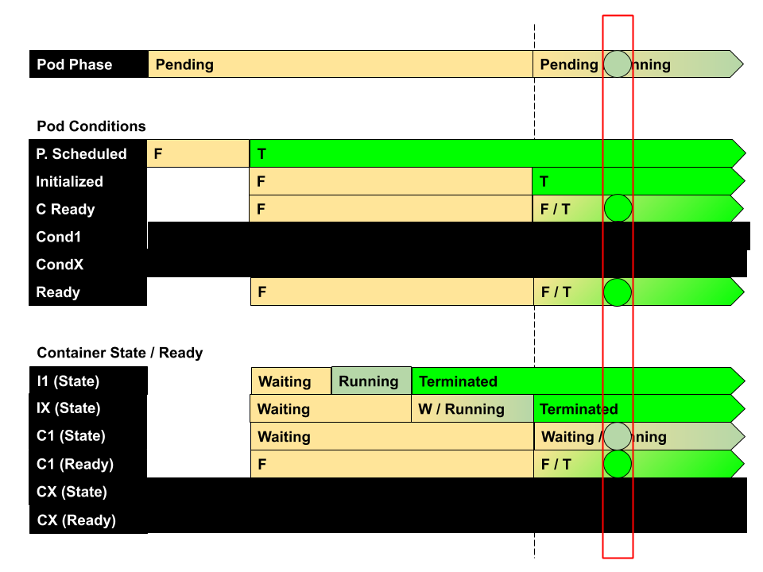

# Application Lifecycle Management: Know Various Ways to Configure Applications

Back to [Certified Kubernetes Administrator (CKA) Tutorial](https://github.com/larkintuckerllc/k8s-cka-tutorial)

## Script

### Not Scheduled (No Node)

Review *not-scheduled*:

Install, inspect, uninstall.

### Not Initialized (No Image)

First, we need to understand what an Init Container is:

> A Pod can have multiple containers running apps within it, but it can also have one or more init containers, which are run before the app containers are started.

Init containers are exactly like regular containers, except:

* Init containers always run to completion.

* Each init container must complete successfully before the next one starts.

*-Kubernetes-[Init Containers](https://kubernetes.io/docs/concepts/workloads/pods/init-containers/)*

Review *not-initialized*:

Install, inspect, uninstall.

### Not Initialized 2 (Bad Cmd)

**note:** Same state as previous; just different reason.

Review *not-initialized-2*:

Install, inspect, uninstall.

### Not Initialized 3 (Second Bad Cmd)

Review *not-initialized-3*:

Install, inspect, uninstall.

### Not Container Ready (No Image)

Review *not-container-ready*:

Install, inspect, uninstall.

### Not Container Ready 2 (Bad Cmd)

Review *not-container-ready-2*:

Install, inspect, uninstall.

### Not Container Ready 2.5 (postStart)

> Analogous to many programming language frameworks that have component lifecycle hooks, such as Angular, Kubernetes provides Containers with lifecycle hooks. The hooks enable Containers to be aware of events in their management lifecycle and run code implemented in a handler when the corresponding lifecycle hook is executed.

* *PostStart*: This hook executes immediately after a container is created.

* *PreStop*: This hook is called immediately before a container is terminated due to an API request or management event such as liveness probe failure, preemption, resource contention and others.

*-Kubernetes-[Pod Lifecycle](https://kubernetes.io/docs/concepts/workloads/pods/pod-lifecycle)*

**note:** Same state as previous; just different reason.

Review *not-container-ready-2*:

Install, inspect, uninstall.

### Not Container Ready 3 (Probe)

First we need to understand probes:

> A Probe is a diagnostic performed periodically by the kubelet on a Container. To perform a diagnostic, the kubelet calls a Handler implemented by the Container. There are three types of handlers.

* *ExecAction*: Executes a specified command inside the Container. 

* *TCPSocketAction*: Performs a TCP check against the Container’s IP address on a specified port.

* *HTTPGetAction*: Performs an HTTP Get request against the Container’s IP address on a specified port and path.

*-Kubernetes-[Pod Lifecycle](https://kubernetes.io/docs/concepts/workloads/pods/pod-lifecycle)*

> The kubelet can optionally perform and react to three kinds of probes on running Containers:

* *livenessProbe*: Indicates whether the Container is running. If the liveness probe fails, the kubelet kills the Container

* *readinessProbe*: Indicates whether the Container is ready to service requests. If the readiness probe fails, the endpoints controller removes the Pod’s IP address from the endpoints of all Services that match the Pod.

* startupProbe: Indicates whether the application within the Container is started. All other probes are disabled if a startup probe is provided, until it succeeds. If the startup probe fails, the kubelet kills the Container

*-Kubernetes-[Pod Lifecycle](https://kubernetes.io/docs/concepts/workloads/pods/pod-lifecycle)*

Probes a number of fields that you can use to more precisely control the behavior of liveness and readiness checks:

* *initialDelaySeconds*: Number of seconds after the container has started before liveness or readiness probes are initiated. Defaults to 0 seconds. Minimum value is 0.

* *periodSeconds*: How often (in seconds) to perform the probe. Default to 10 seconds. Minimum value is 1.

* *timeoutSeconds*: Number of seconds after which the probe times out. Defaults to 1 second. Minimum value is 1.

* *successThreshold*: Minimum consecutive successes for the probe to be considered successful after having failed. Defaults to 1. Must be 1 for liveness. Minimum value is 1.

* *failureThreshold*: When a Pod starts and the probe fails, Kubernetes will try failureThreshold times before giving up. Giving up in case of liveness probe means restarting the container. In case of readiness probe the Pod will be marked Unready. Defaults to 3. Minimum value is 1.

*-Kubernetes-[Configure Liveness, Readiness and Startup Probes](https://kubernetes.io/docs/tasks/configure-pod-container/configure-liveness-readiness-startup-probes/)*

Review *not-container-ready-3*:

Install, inspect, uninstall.

### Not Ready

> Your application can inject extra feedback or signals into PodStatus: Pod readiness. To use this, set readinessGates in the PodSpec to specify a list of additional conditions that the kubelet evaluates for Pod readiness.
> To set these status.conditions for the pod, applications and operators should use the PATCH action. You can use a Kubernetes client library to write code that sets custom Pod conditions for Pod readiness.

*-Kubernetes-[Pod Lifecycle](https://kubernetes.io/docs/concepts/workloads/pods/pod-lifecycle)*

Review *not-ready*:

Install, inspect, uninstall.

### Ready

Review *ready*:

Install, inspect, uninstall.
