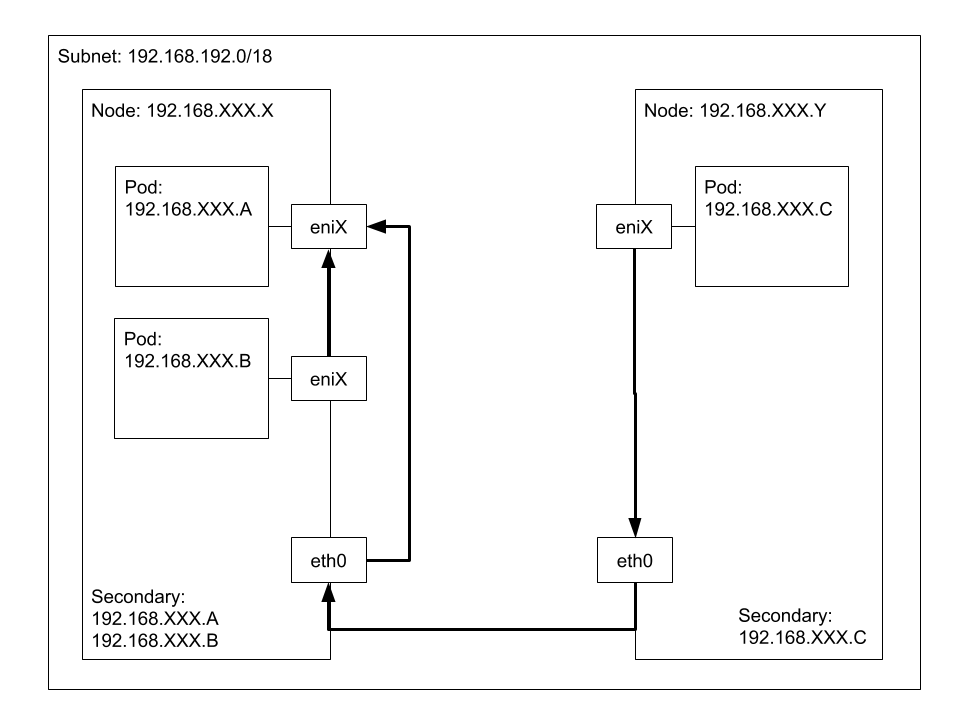

# Networking: Understand Pod Networking Concepts

Back to [Certified Kubernetes Administrator (CKA) Tutorial](https://github.com/larkintuckerllc/k8s-cka-tutorial)

**note:** Includes the following additional topics:

* Troubleshoot: Troubleshoot Application Failure

[/0.jpg)](https://youtu.be/BnsNv8b3LzE)

## Script

### Sidebar into Container Logs

> Everything a containerized application writes to stdout and stderr is handled and redirected somewhere by a container engine.

*-Kubernetes-[Logging Architecture](https://kubernetes.io/docs/concepts/cluster-administration/logging/)*

A simple example:

```plaintext
helm install dev debug
```

```plaintext
kubectl logs example-dev
```

**note:**: *--container* flag to specify container. *--previous* flag used to look at logs from previous container in case it crashes.

> However, the native functionality provided by a container engine or runtime is usually not enough for a complete logging solution. For example, if a container crashes, a pod is evicted, or a node dies, you’ll usually still want to access your application’s logs. As such, logs should have a separate storage and lifecycle independent of nodes, pods, or containers. This concept is called cluster-level-logging. Cluster-level logging requires a separate backend to store, analyze, and query logs. Kubernetes provides no native storage solution for log data, but you can integrate many existing logging solutions into your Kubernetes cluster.

*-Kubernetes-[Logging Architecture](https://kubernetes.io/docs/concepts/cluster-administration/logging/)*

For EKS, see... [Setting Up Container Insights on Amazon EKS and Kubernetes](https://docs.aws.amazon.com/AmazonCloudWatch/latest/monitoring/deploy-container-insights-EKS.html)

### Pod Networking

> Each Pod is assigned a unique IP address for each address family. Every container in a Pod shares the network namespace, including the IP address and network ports. Containers inside a Pod can communicate with one another using localhost. When containers in a Pod communicate with entities outside the Pod, they must coordinate how they use the shared network resources (such as ports).

*-Kubernetes-[Pod Overview](https://kubernetes.io/docs/concepts/workloads/pods/pod-overview/)*

> List of ports to expose from the container. Exposing a port here gives the system additional information about the network connections a container uses, but is primarily informational. Not specifying a port here DOES NOT prevent that port from being exposed. Any port which is listening on the default "0.0.0.0" address inside a container will be accessible from the network.

*-Kubernetes-[Reference](https://kubernetes.io/docs/reference/generated/kubernetes-api/v1.18/#podspec-v1-core)*

A simple example:

```plaintext
helm install dev networking
```

Follow logs:

```plaintext
kubectl logs example-dev --container httpd --follow
```

Login into *httpd* container:

```plaintext
kubectl exec example-dev -it --container httpd -- bash
```

View web page:

```plaintext
apt-get update
apt-get install curl -y
curl localhost
```

Observe source:

```plaintext
cat htdocs/index.html
```

Sidebar into logs: notice *logs* folder empty.

```plaintext
ls logs
```

Notice logs being sent to process' STDOUT:

```plaintext
grep CustomLog conf/httpd.conf
```

Can write directly to STDOUT (process id 1):

```plaintext
echo hello >> /proc/1/fd/1
```

Can also signal the process:

```plaintext
kill -HUP 1
```

Login into *ubuntu* container:

```plaintext
kubectl exec example-dev -it --container ubuntu -- bash
```

View web page:

```plaintext
apt-get update
apt-get install curl
curl localhost
```

Sidebar showing process on id 1:

```plaintext
ps -aux
```

### Cluster Networking

Notice IP address.

```plaintext
kubectl describe pod example-dev
```

```plaintext
helm install another tester
```

kubectl exec example-another -it -- bash

apt-get update
apt-get install curl -y
curl XXX.XXX.XXX.XXX

How does does the traffic from this Pod (maybe on another Node) to this IP address make its way to the other Pod?

### Cluster Networking (Under the Hood)

Login to Node and curl address of Pod.

How is traffic to this IP address getting to Pod?



First, notice that this IP address is allocated from the VPC subnet of the Nodes. This is because of the AWS Pod Networking add-on.

Next, look at AWS on Node EC2 and notice secondary IP address.  This means that Node will listen on this IP address.

```plaintext
ifconfig
```

```plaintext
route
```

### Pod IPC

Let us change things up and look at another way to communicate between containers.

> This page shows how to configure process namespace sharing for a pod. When process namespace sharing is enabled, processes in a container are visible to all other containers in that pod.
> You can use this feature to configure cooperating containers, such as a log handler sidecar container, or to troubleshoot container images that don’t include debugging utilities like a shell.

*-Kubernetes-[Share Process Namespace between Containers in a Pod](https://kubernetes.io/docs/tasks/configure-pod-container/share-process-namespace/)*

```plaintext
helm install dev ipc
```

Look at logs:

```plaintext
kubectl logs example-dev --container httpd --follow
```

```plaintext
kubectl exec example-dev --container ubuntu -it -- bash
```

```plaintext
ps -aux
kill -HUP XX
```
