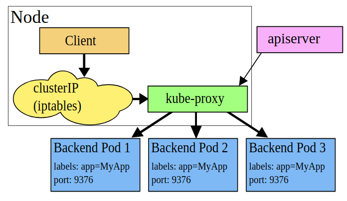
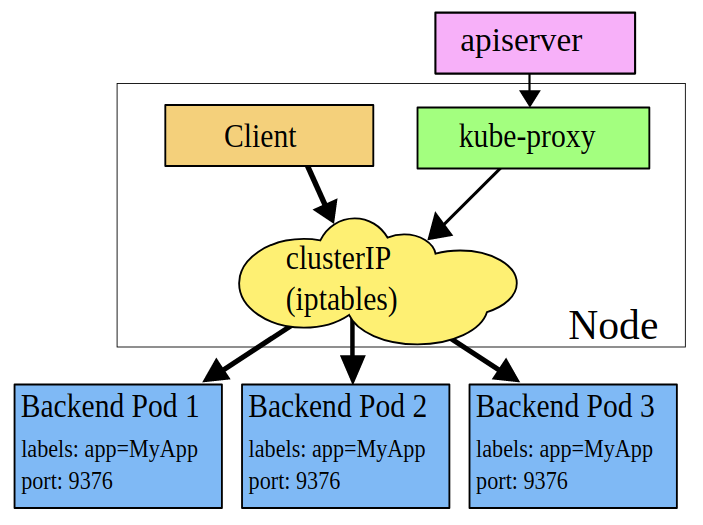

# Core Concepts: Understand Services and other Network Primitives

Back to [Certified Kubernetes Administrator (CKA) Tutorial](https://github.com/larkintuckerllc/k8s-cka-tutorial)

**note:** Includes the following additional topics:

* Networking: Understand Service Networking

* Networking: Understand CNI

[](https://youtu.be/BGfs_JGibV4)

## Script

### Basic Cluster IP Example

> Kubernetes Pods are mortal. They are born and when they die, they are not resurrected. If you use a Deployment to run your app, it can create and destroy Pods dynamically.
> Each Pod gets its own IP address, however in a Deployment, the set of Pods running in one moment in time could be different from the set of Pods running that application a moment later.
> This leads to a problem: if some set of Pods (call them “backends”) provides functionality to other Pods (call them “frontends”) inside your cluster, how do the frontends find out and keep track of which IP address to connect to, so that the frontend can use the backend part of the workload?
> Enter Services

*-Kubernetes-[Service](https://kubernetes.io/docs/concepts/services-networking/service/)*

Install service and inspect:

Notice IP, ClusterIP, port, targetPort, and Endpoint

```plaintext
helm install dev service

kubectl get all

kubectl describe service example-dev

kubectl get service example-dev -o yaml
```

Login to ubuntu Pod, update, install:

```plaintext
kubectl exec example-dev -it -- bash

apt-get update
apt-get install dnsutils -y
apt-get install curl -y
```

Discover services:

```plaintext
printenv

cat /etc/resolv.conf

nslookup example-dev.default

curl example-dev.default
```

**note**: Noticed that *curl* did not properly handle *curl example-dev*

### Behind the Scenes

So how is traffic getting to the service IP address?

> Every node in a Kubernetes cluster runs a kube-proxy. kube-proxy is responsible for implementing a form of virtual IP for Services of type other than ExternalName.

*-Kubernetes-[Service](https://kubernetes.io/docs/concepts/services-networking/service/)*

There are three ways a Cluster can be configured: User Space Proxy Mode, iptables Proxy Mode, and IPVS proxy mode.

TODO: CNI

#### User Space Proxy Mode

> In this mode, kube-proxy watches the Kubernetes master for the addition and removal of Service and Endpoint objects. For each Service it opens a port (randomly chosen) on the local node. Any connections to this “proxy port” are proxied to one of the Service’s backend Pods (as reported via Endpoints). kube-proxy takes the SessionAffinity setting of the Service into account when deciding which backend Pod to use.
> Lastly, the user-space proxy installs iptables rules which capture traffic to the Service’s clusterIP (which is virtual) and port. The rules redirect that traffic to the proxy port which proxies the backend Pod.



*-Kubernetes-[Service](https://kubernetes.io/docs/concepts/services-networking/service/)*

#### iptables Proxy Mode

> In this mode, kube-proxy watches the Kubernetes control plane for the addition and removal of Service and Endpoint objects. For each Service, it installs iptables rules, which capture traffic to the Service’s clusterIP and port, and redirect that traffic to one of the Service’s backend sets. For each Endpoint object, it installs iptables rules which select a backend Pod.



*-Kubernetes-[Service](https://kubernetes.io/docs/concepts/services-networking/service/)*

#### IPVS Proxy Mode

> In ipvs mode, kube-proxy watches Kubernetes Services and Endpoints, calls netlink interface to create IPVS rules accordingly and synchronizes IPVS rules with Kubernetes Services and Endpoints periodically. This control loop ensures that IPVS status matches the desired state. When accessing a Service, IPVS directs traffic to one of the backend Pods.

*-Kubernetes-[Service](https://kubernetes.io/docs/concepts/services-networking/service/)*

This is a high-performance feature that we will not address in this series; there is an article on it at [IPVS-Based In-Cluster Load Balancing Deep Dive](https://kubernetes.io/blog/2018/07/09/ipvs-based-in-cluster-load-balancing-deep-dive/).

**note:** IPVS is not currently supported in EKS; but looks like some folks have gotten it to work.

#### AWS Implementation

TODO
