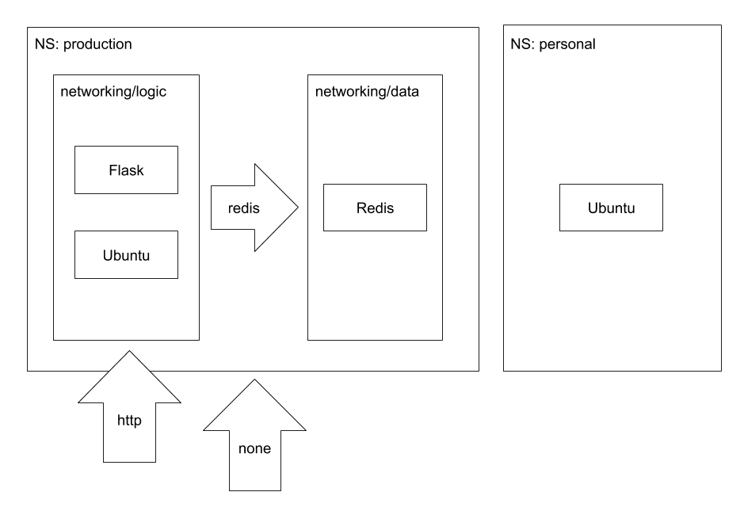

# Security: Know How to Use Network Policies

Back to [Certified Kubernetes Administrator (CKA) Tutorial](https://github.com/larkintuckerllc/k8s-cka-tutorial)

[](https://youtu.be/mZut69rBfZ4)

## Script

### Sidebar into Building Image

To illustrate the material in this video, we need a more complex application that involves inter-Pod communication.  In this case we have a Flask (Python) application providing an API backed by a Redis database.

The application is provided in the *app* folder and *Docker* file but the specifics of it are outside of the scope of this video; we will treat it as a black box.

We do however need to turn this into a Docker image that we can use in our K8s Cluster.

The first step is to create an AWS ECR repository (look at it).

We follow the instructions provided in ECR; only additional step was to tag a specific version.

```plaintext
docker tag todos:latest 143287522423.dkr.ecr.us-east-1.amazonaws.com/todos:0.1.0

docker push 143287522423.dkr.ecr.us-east-1.amazonaws.com/todos:0.1.0
```

### Secure Mutli-Tier Application

As you may have noticed so far, by default, any Pod can communicate to any other Pod (or be exposed externally, i.e., LoadBalancer). This is not consistent with the pattern of a secure multi-tier application.

To help understand the pattern, let us look at an example (first conceptually):



* *Logic (or Application) Tier*: Say a Flask application providing an API

* *Data Tier*: Say a Redis database storing the application's data

* Data Tier only accessible from Logic Tier; and limited to redis port

* Logic Tier generally accessible; and limited to http port

* For demonstration, put an Ubuntu Pod in the Logic Tier and another one elsewhere

So how do these tiers relate to K8s concepts?

Thinking about tiers as basically groupings of Pods, it is unsurprising that we use K8s labels and Namespaces to define these tiers. In this example, the tiers are defined by:

* *Logic Tier*: Pods with namespace: *production* with a label *network/logic*: *true*

* *Data Tier*: Pods with namespace: production with a label *network/data*: *true*

**note:**: The specific label key / values is arbitrary.

Look at: *flask-deployment.yaml*, *redis-development.yaml*, and *ubuntu-production-pod.yaml*.

### Install Project Calico into EKS

Before we can use NetworkPolicy objects, we need an supporting addon.

> Project Calico is a network policy engine for Kubernetes. With Calico network policy enforcement, you can implement network segmentation and tenant isolation. This is useful in multi-tenant environments where you must isolate tenants from each other or when you want to create separate environments for development, staging, and production. Network policies are similar to AWS security groups in that you can create network ingress and egress rules. Instead of assigning instances to a security group, you assign network policies to pods using pod selectors and labels.

*-AWS-[Installing Calico on Amazon EKS](https://docs.aws.amazon.com/eks/latest/userguide/calico.html)*

**note:** This is separate from the Calico CNI addon.

Easiest to understand NetworkPolicy objects by example.

### Isolated and Non-Isolated Pods

> By default, pods are non-isolated; they accept traffic from any source.
> Pods become isolated by having a NetworkPolicy that selects them. Once there is any NetworkPolicy in a namespace selecting a particular pod, that pod will reject any connections that are not allowed by any NetworkPolicy.

*-Kubernetes-[Network Policies](https://kubernetes.io/docs/concepts/services-networking/network-policies/)*

Technically, isolation is specific to ingress and egress traffic separately; we will only be considering ingress in this video.

Look at *any-from-any-none-network-policy.yaml*.  This is a special case NetworkPolicy that targets all Pods in the *production-X* Namespace and provides an empty set of Ingress rules; this causes all the Pods in *production-X* to be isolated.

So without any other matching NetworkPolicy objects, no traffic can reach (Ingress) the Pods in the *production-X* namespace.  Then additional NetworkPolicy objects open up access in an additive fashion.

### Opening Up the Data Tier

Look at *data-from-logic-redis-network-policy.yaml*. This targets all Pods in the *production-X* namespace with a label *networking/data*: *true* (aka Data Tier).

The rule here enables Redis traffic from Pods in the *production-X* namespace with a label *networking/logic*: *true* (aka Logic Tier).

### Opening Up the Logic Tier

Look at *logic-from-any-http-network-policy.yaml*. This targets all Pods in the *production-X* namespace with a label *networking/logic*: *true* (aka Logic Tier).

The rule here enables HTTP traffic from any source (no *from*).

### Validating the Solution

First we make sure that it works as expected; does not really show the Network Policies because this would have worked without them.

First show can access the Data Tier from Ubuntu container in Logic Tier.

Have to install *redis-tools* and try to use *redis-cli* to connect to Redis.

```plaintext
kubectl exec ubuntu-dev -it -- bash
```

But not work from the Ubuntu container not in the Logic Tier.

### Selectors

We only use one kind of selector in our example, *podSelector*, but ther are others:

> There are four kinds of selectors that can be specified in an ingress from section or egress to section:

* *podSelector*: This selects particular Pods in the same namespace as the NetworkPolicy which should be allowed as ingress sources or egress destinations.

* *namespaceSelector*: This selects particular namespaces for which all Pods should be allowed as ingress sources or egress destinations.

* *namespaceSelector* and *podSelector*: A single to/from entry that specifies both namespaceSelector and podSelector selects particular Pods within particular namespaces.

* *ipBlock*: This selects particular IP CIDR ranges to allow as ingress sources or egress destinations. These should be cluster-external IPs, since Pod IPs are ephemeral and unpredictable

*-Kubernetes-[Network Policies](https://kubernetes.io/docs/concepts/services-networking/network-policies/)*
