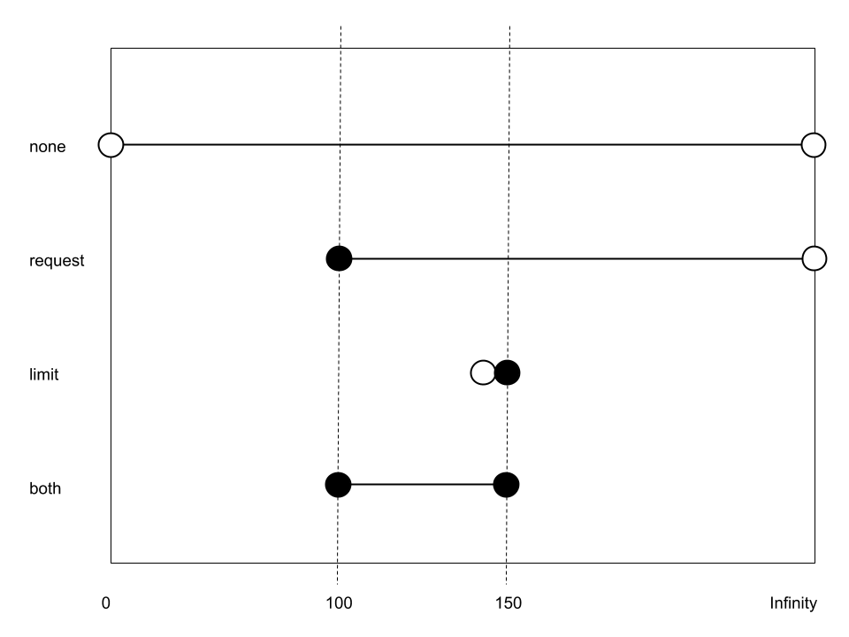
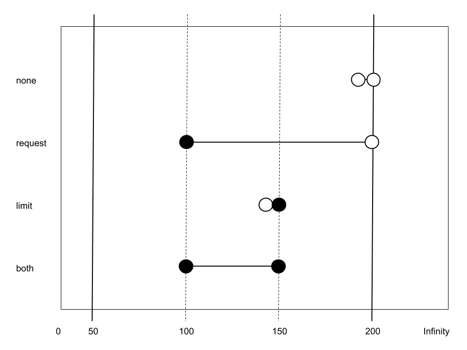
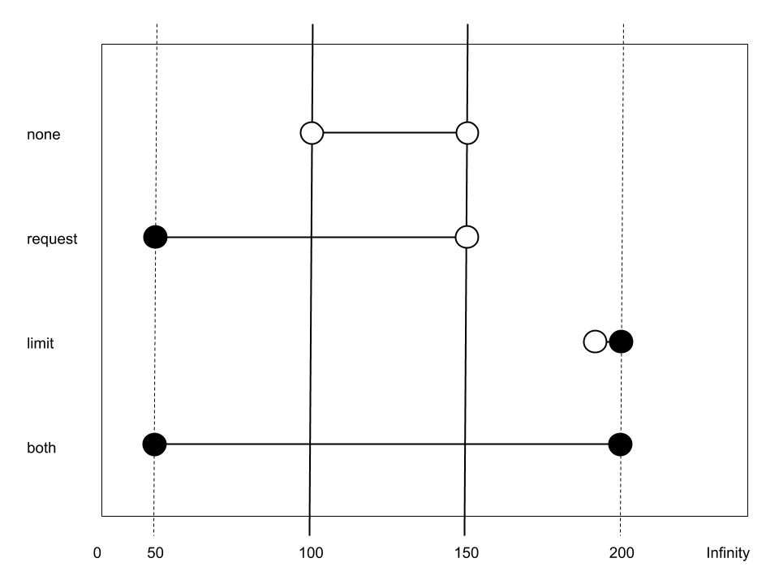

# Scheduling: Understand How Resource Limits Can Affect Pod Scheduling

Back to [Certified Kubernetes Administrator (CKA) Tutorial](https://github.com/larkintuckerllc/k8s-cka-tutorial)

[]()

## Script

### Requests and Limits Combinations

```plaintext
helm install dev combinations
```

Guessing general rules:

* Request <= Limit

* Maximum Limit Defaults to Infinity (0)

* (Limit) No Limit No Default: Maximum

* (Request) No Request and Limit: Limit

* (Request) No Request and No Limit: Complicated

(Request) No Request and No Limit:

* No Default No Max: Zero (0)



### LimitRange Min-Max

> By default, containers run with unbounded compute resources on a Kubernetes cluster. With resource quotas, cluster administrators can restrict resource consumption and creation on a namespace basis. Within a namespace, a Pod or Container can consume as much CPU and memory as defined by the namespace’s resource quota. There is a concern that one Pod or Container could monopolize all available resources. A LimitRange is a policy to constrain resource allocations (to Pods or Containers) in a namespace.

and

> A LimitRange provides constraints that can:

* Enforce minimum and maximum compute resources usage per Pod or Container in a namespace.

* Enforce minimum and maximum storage request per PersistentVolumeClaim in a namespace.

* Enforce a ratio between request and limit for a resource in a namespace.

* Set default request/limit for compute resources in a namespace and automatically inject them to Containers at runtime.

*-Kubernetes-[Limit Ranges](https://kubernetes.io/docs/concepts/policy/limit-range/)*

Example of minimum and maximum:

```plaintext
helm install dev min-max
```

(Request) No Request and No Limit

* No Default Max: Max



### LimitRange Default

Example of default:

```plaintext
helm install dev default
```

Guessing general rules:

* (Limit) No Limit Default: Default

(Request) No Request and No Limit:

* Default: Default



### Resource Quotas

> When several users or teams share a cluster with a fixed number of nodes, there is a concern that one team could use more than its fair share of resources.

and

> Resource quotas are a tool for administrators to address this concern.

and

> A resource quota, defined by a ResourceQuota object, provides constraints that limit aggregate resource consumption per namespace. It can limit the quantity of objects that can be created in a namespace by type, as well as the total amount of compute resources that may be consumed by resources in that project.

*-Kubernetes-[Resource Quotas](https://kubernetes.io/docs/concepts/policy/resource-quotas/)*

Will only consider compute resources:

```plaintext
helm install dev quotas
```

Observe quotas.
